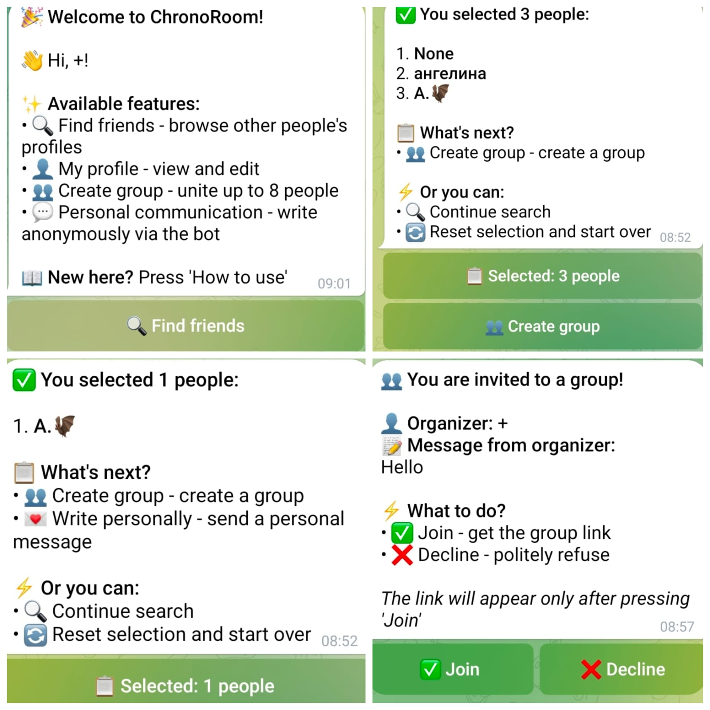

# ChronoRoom — Profile Board Telegram Bot

A Telegram bot for discovering people through profiles, starting anonymous conversations, and creating group chats around shared interests.

## 📸 Demo



## ✨ Features

- 🌍 Browse user profiles
- 👤 Personal profiles
- 💬 Anonymous communication
- 📨 Personal message requests
- 👥 Select multiple users
- 🏠 Create group chats
- 🔗 Telegram group invitations
- ✅ Accept or decline invitations
- 📝 Optional messages for group invitations
- 🔐 Telegram subscription check
- 💾 Persistent data storage

## 🔄 How It Works

1. The user opens the profile board.
2. Available profiles are displayed.
3. The user can select a person to communicate with.
4. For multiple selected users, the bot can create a group invitation.
5. The organizer provides the Telegram group link.
6. Selected users receive an invitation.
7. Users can accept or decline the invitation.
8. Users who accept receive the group link.

## 👥 Group Invitations

The bot allows users to:

- select several profiles;
- create a group;
- provide a Telegram invite link;
- add an optional message;
- send invitations to selected users;
- process accept/decline responses.

## 🧩 Project Structure

```text
ChronoRoom-Bot4/
├── README.md
├── screenshots/
│   └── demo.jpg
└── chronoroom_final.py
```
